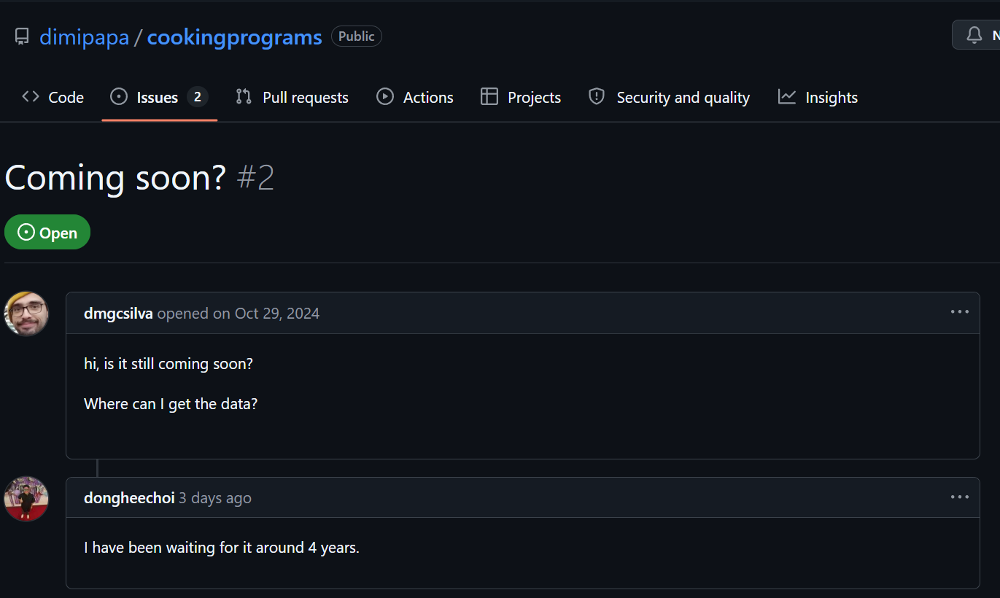

# ~~Culinary Design for Descent: Differentiable Program Discovery for Procedural Recipes~~ Designing a Culinary Domain Specific Language

CS 348K — Advit Deepak (advit@stanford.edu)

---

## Week 6 Checkpoint Update

My original proposal depended on **Papadopoulos et al. (CVPR 2022)** — *"Learning Program Representations for Food Images and Cooking Recipes"* — whose model would have been our supervision signal. Their paper had a GitHub link, and I misassumed that the code was actually available. In reality, when I went to download their image model and data, I realized that their code has been marked as **"Coming Soon"** for the past four years, much to the frustration of others like me.



As a result, I had to pivot the project plan. Instead of spending time trying to replicate their paper (which involved hiring Amazon Mechanical Turk and paying $2000 for data labeling), I decided to instead focus on how to design a useful recipe DSL and how to verify a recipe program.

### What I explored before pivoting

A lot of last week was just figuring out how to proceed. A few things I tried:

- **RecipeGen dataset** — I downloaded the full dataset (~15GB) from [HuggingFace](https://huggingface.co/datasets/RUOXUAN123/RecipeGen/resolve/main/test.zip). It has 4,389 recipes with step-by-step photos, which looked promising as a supervision source. After digging in, the step images are too noisy and inconsistently photographed (also had some watermarks) to use as a reliable training signal — different angles, lighting, zoom, and many steps produce no visible change at all.

- **Recipe1M** — I went through the access request process (filling out a form) and was granted access to the dataset. I examined some recipe-image pairs and realized the same problem: the images are scraped from the web and are wildly inconsistent in quality, framing, and even content (some are stock photos, some are the actual dish, some are mid-cook process shots). Using image similarity as a supervision signal would require either a much cleaner dataset or a trained recipe-image model — which brought us back to the unreleased Papadopoulos code. Regardless, it didn't feel like a good fit for the course project.

That exploration is what led me to the current direction: instead of using images as a supervision signal (which required Papadopoulos's unreleased model), I shifted to the program representation problem itself. What makes a recipe DSL good? What DSLs already exist in the literature? Can we measure DSL quality without images at all?

### Literature survey

Next, I spent several days extensively surveying every known recipe representation (Recipe Flow Graphs, MILK/CURD, Inverse Cooking, FoodKG, RecipeGen), and found that none of the existing representations are proper DSLs. Every one has free natural language somewhere in its structure, making them inexact. For instance, MILK predicates are the closest but their arguments are strings like `"medium heat until browned on both sides"`.

### What makes a good recipe DSL?

After this literature review, I reflected deeply about what the key properties of a good DSL would be. I came up with four:

**Exact** — Every symbol is typed: `boil(water, pasta, 10min)` not `"boil the pasta until al dente"`. This matters because you can't verify what you can't formalize. If a DSL allows `"cook until done"` as an argument, the language has punted the hard problem. I think we can handle this by restricting arguments to enumerated types and numeric quantities — no free-form strings.

**Verifiable** — Given a program, I should be able to automatically check whether it describes a valid cooking sequence — no inexact/LLM-based judging, but rather deterministic predicate logic over the DAG. I'm starting to build a set of predicates grounded in published sources (FDA food safety guidelines, MILK formal semantics, basic thermodynamics) — *more on what's implemented and what's still in progress in the Constraint Verifier section below.*

**Buildable from Language** — I believe a DSL is useless if you can't populate it easily. I noticed a lot of DSLs proposed in literature had barely any adoption and barely any data of recipes in that DSL format. A lot of them were hand-curated, like Recipe Flow Graphs. I built an LLM-based parser (`culinary_descent/parser/llm_parser.py`) using Perplexity (had free credits) that takes a free-text recipe from Recipe1M and outputs a sample DSL I designed (RecipeDAG). Some examples are in `data/sample_parses/`.

**Efficient** — For practicality, I will deliberately constraint the vocabulary rather than trying to cover everything. Right now, the proposed DSL supports 55 ingredients, 31 operations, 9 ingredient categories, 5 operation groups, which was bootstrapped from published Recipe1M analyses (Salvador et al. CVPR 2019). Whether this is the right size is actually one of the things I want to measure: I'm still working on it, but `evaluate_coverage.py` will show the distribution of ingredients/operations/categories that actually appear in Recipe1M, so I can see what's missing and what's redundant. The goal is a bounded vocabulary — I just haven't pinned down the exact bound yet.

### New north star: two metrics

| Metric | Question | Script |
|---|---|---|
| **DSL coverage** | What % of Recipe1M parses into valid programs? | `scripts/evaluate_coverage.py` |
| **Verification recall** | Given known violations, what % does the verifier catch? | `scripts/evaluate_verification.py` |

My natural language recipe parser is working on real recipes — see examples below (and in `data/sample_parses/`). My verifier is a work in progress; the current 8 predicates I've hand-crafted from literature achieve 8/8 recall on a synthetic test suite, and I'm expanding them — see the Constraint Verifier section below for the planned approaches.

### Week 6: Goals and experiments

**What am I trying to answer?**

Can we design a recipe DSL that is (1) expressive enough to represent real recipes at scale, and (2) precise enough to mechanically detect when a recipe is logically invalid? I want to answer if a typed, graph-based recipe program is a meaningful improvement over free text recipes, and can we actually measure that?

**What experiments answer this, and how do I know if I've succeeded?**

*Experiment 1 — DSL coverage (`evaluate_coverage.py`):* Run the LLM parser on a random sample of Recipe1M recipes (targeting n=200+) and measure: what % parse into a valid RecipeDAG, what % are flagged as out-of-scope, and what % fail parsing entirely. I'll also look at the distribution of out-of-vocabulary ingredients and operations — that tells me whether the vocabulary needs expanding. I think success looks like >60% of in-scope recipes parsing into valid programs. If it's much lower, the vocabulary is too narrow or the parser is unreliable, and I'll know which from the breakdown!

*Experiment 2 — Verifier recall (`evaluate_verification.py`):* I will build a synthetic test set of recipes with known violations (one per predicate) and measure recall per predicate and false positive rate on valid controls. As I add predicates from the literature, each new one gets a corresponding test case.

Coverage (Exp1) says if the DSL is expressive enough to be useful. Recall (Exp2) says the verifier is trustworthy enough to catch real problems.

### The contribution

So far, I've designed a recipe DSL with formally grounded, verifiable semantics and set up evaluation for two properties: (1) what fraction of real recipes it can express, and (2) what fraction of cooking logic violations it can detect. I've also built a parser that converts real Recipe1M recipes into this DSL using the Perplexity API.

### The current recipe DSL (RecipeDAG)

A recipe is a **directed acyclic graph** (DAG) with three node types:

- **Ingredient** leaf nodes — each typed with a canonical name, a category from 9 food groups (`PROTEIN`, `VEGETABLE`, `ALLIUM`, `GRAIN`, `DAIRY`, `FAT`, `SEASONING`, `LIQUID`, `FRUIT`), and two boolean flags (`is_protein`, `is_liquid`) that drive the verifier constraints.
- **Operation** internal nodes — each carries an `OperationType` (31 total) and optional named parameters (e.g. `{"minutes": 10, "temp_c": 180}`). Every operation has metadata specifying its semantic group, whether it requires heat, whether it requires a liquid input, and its valid input arity.
- A single **DISH_OUTPUT** root — no outgoing edges; everything must flow into it.

Edges encode **material flow**: an edge `A → B` means "A's output is consumed by B."

The 31 operation types are organized into 5 groups drawn from MILK's semantic primitives (Tasse & Smith 2008):

| Group | Operations |
|---|---|
| `PREP` | chop, slice, dice, mince, peel, grate, drain, rinse |
| `DRY_HEAT` | saute, fry, sear, roast, bake, grill, broil, toast |
| `MOIST_HEAT` | boil, simmer, steam, poach, braise |
| `COMBINE` | mix, blend, whisk, fold, toss, stir, combine |
| `FINISH` | season, plate, garnish, rest |

The ingredient vocabulary currently has 55 entries, bootstrapped from the top-frequency entries in Salvador et al. (CVPR 2019) and the in-scope ingredients for the 5 dish categories. The DSL is scoped to **5 dish categories**: PASTA, EGGS, SALAD, STIR_FRY, SOUP.

Programs serialize to and from JSON (`to_dict` / `from_dict`) and to a natural-language string (`to_text()`) via topological sort — the text form is what the constraint verifier and coverage evaluator operate on.

---

## Parser: Examples

The parser runs on real Recipe1M recipes via Perplexity Sonar. Full sample saved in `data/sample_parses/sample_10.json`. Two examples:

**Valid parse — Artichoke Heart Soup**

Input (free text):
```
ingredients: artichokes raw, chicken broth, lemon juice raw, cream heavy whipping, ...
instructions: Combine artichoke hearts, broth and lemon juice. Bring to a boil,
              and simmer for 15 min. Blend until smooth. Stir in cream.
```

Output — the RecipeDAG program (typed nodes + edges):
```
Ingredient  artichoke_hearts  category=vegetable  is_protein=false  is_liquid=false
Ingredient  chicken_broth     category=liquid     is_protein=false  is_liquid=true
Ingredient  lemon_juice       category=liquid     is_protein=false  is_liquid=true
Ingredient  heavy_cream       category=dairy      is_protein=false  is_liquid=true
Ingredient  butter            category=fat        is_protein=false  is_liquid=false

n5  = combine(artichoke_hearts, chicken_broth, lemon_juice)
n6  = boil(n5)                   # moist-heat ✓ liquid present
n7  = simmer(n6)
n8  = combine(n7, heavy_cream)
n9  = simmer(n8)
n10 = saute(butter)
n11 = garnish(n9, n10)
→   dish_output
```

Compiled back to text via `to_text()`:
```
A dish of Artichoke Heart Soup. Ingredients: artichoke hearts, chicken broth,
lemon juice, heavy cream, butter. Preparation: combine artichoke hearts and
chicken broth and lemon juice; boil combine; simmer boil; combine simmer and
heavy cream; garnish simmer.
→ category: soup | 5 ingredients, 7 operations | VALID ✓
```

**Violation caught — Smoked Fish Potato Salad**

Input (free text):
```
ingredients: smoked fish, potatoes raw, celery raw, pickles cucumber sour, ...
instructions: Boil and cool potatoes. Combine all ingredients. Mix dressing. Toss.
```

Output — the RecipeDAG program:
```
Ingredient  smoked_fish  category=protein  is_protein=true  is_liquid=false
Ingredient  potato       category=vegetable ...
...

n4 = boil(potato, water)
n5 = combine(smoked_fish, n4, celery, pickles, ...)   # smoked_fish enters combine raw!
n6 = toss(n5, dressing)
→   dish_output
```

Verifier output:
```
→ category: salad | 9 ingredients, 4 operations
→ INVALID: raw_protein_before_plate
   [FDA] Protein 'smoked fish' reaches dish without passing through any heat operation
```

*(Note: smoked fish is pre-cured and arguably doesn't need heat — I realize now that this is a known false positive that reveals the `is_cured` attribute is missing from the ingredient type. Adding it is on the todo list + I will think of better ways to generate/validate verifiers!)*

---

## Constraint Verifier

As of now, I'm building the verifier from the literature — working through what constraints are actually grounded in published sources vs. my own assumptions. However, I'm thinking of more scalable methods, such as analyzing all recipe DAGs in our dataset (after running the parser) and identifying all missing transitions/operations, which likely mean they lead to invalid recipes, and verifying with an LLM. Or perhaps having an LLM adversarially generate invalid ones and checking if the verifier catches them.

**Implemented (8 predicates):**

| Rule | Source |
|---|---|
| DAG structural invariants | [RFG] Yamakata 2020 |
| Raw protein must be heat-treated before serving | [FDA] FSMA HACCP |
| Solid ingredient directly into BLEND | [DC] |
| Heat operation after PLATE | [MILK] Tasse & Smith 2008 |
| Moist heat without liquid input | [PHYS] McGee 2004 |
| COMBINE/MIX/TOSS with fewer than 2 inputs | [MILK] |
| Operation output never consumed | [MILK] |
| SEASON with only seasoning inputs | [DC] |

---

## How to Run

```bash
# Verifier recall — offline, no API key needed
python scripts/evaluate_verification.py

# Coverage — requires PERPLEXITY_API_KEY and Recipe1M
export PERPLEXITY_API_KEY=pplx-...
python scripts/evaluate_coverage.py --recipe1m-path /path/to/recipe1m --n 200
```

---

## Codebase

```
culinary_descent/
├── dsl/
│   ├── vocabulary.py         — ingredient + operation types
│   └── recipe_dag.py         — RecipeDAG dataclass
├── constraints/
│   └── verifier.py           — MoVer-style constraint predicates (in progress)
└── parser/
   └── llm_parser.py         — Perplexity Sonar: NL recipe → RecipeDAG

scripts/
├── evaluate_coverage.py      — Metric 1: Recipe1M parse + validity rate
└── evaluate_verification.py  — Metric 2: verifier recall on synthetic test set

data/sample_parses/
└── sample_10.json            — 10 real Recipe1M recipes parsed end-to-end

recipes.json - 242MB, downloaded from Recipe1M dataset
```


> Note: I also wanted to apologize for a slightly late (~1 hr) commit! I didn't realize the checkpoint was due EOD/at midnight. I mis-remembered and believed it was a fuzzy/soft deadline like the proposal, and it wasn't until my friend texted that I realized.