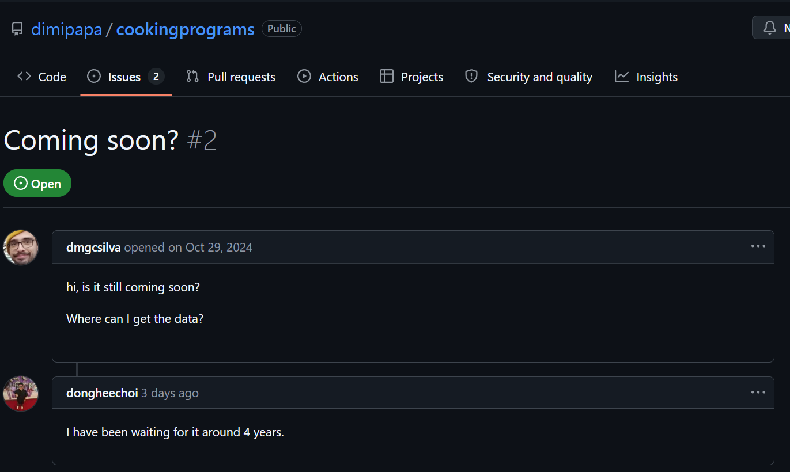
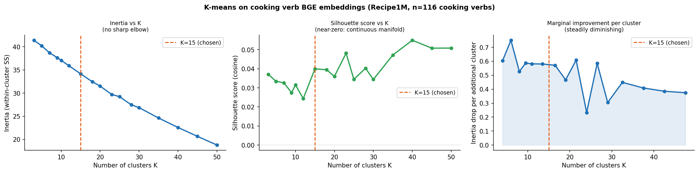
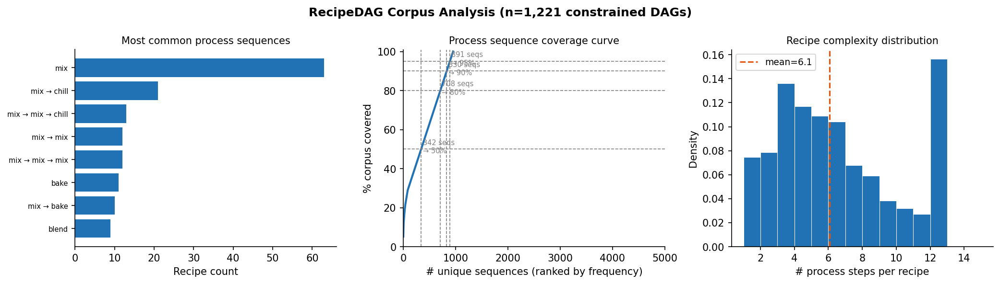
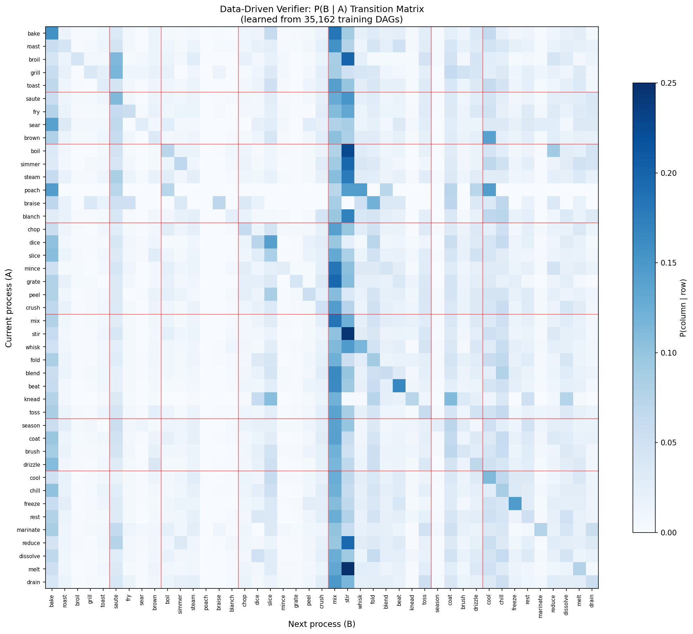

# Recipe DAGs: Typed Process Sequences from Natural Language

**CS 348K — Advit Deepak (advit@stanford.edu) · Checkpoint 2**

---

## The Problem

Recipes are unstructured text. Everything about the cooking process — the order of steps, which ingredient gets used where, how long things take, what can happen in parallel — is buried in prose. Because text is written to be read top-to-bottom, not queried, things like the following are hard:

- **Search by technique, not keywords.** Many cooking techniques are defined entirely by the order of steps, not by ingredients. A dry brine is `season → rest → cook`. A fond-based pan sauce is `sear → deglaze → reduce`. A reverse sear is `slow-roast → sear`. These sequences are invisible to keyword search — both "sear" and "deglaze" can appear in a recipe that deglazes two steps later into a completely different pan, with no fond involvement at all. You can't find recipes that actually use a technique without knowing what order things happen in.
- **Dietary substitution.** The same ingredient requires different substitutes depending on which step uses it. An egg in a cake batter (a `mix` step) is acting as a binder — any plant-based gel substitute works fine. The same egg in a crème brûlée (a `steam` step) is forming a heat-set protein gel; no common plant-based substitute does the same thing. "Replace all eggs" as a text substitution produces edible cake and inedible custard. Knowing which step the egg appears in is what makes the substitution decision computable rather than a guess.
- **Parallelization.** Most recipe instructions are written sequentially even when steps could happen simultaneously. "While the sauce simmers, prep the vegetables" is sometimes written out, but often not. Figuring out which steps are independent requires understanding ingredient flow — which step's output feeds into which step's input. (The current implementation is a linear chain; full parallelization detection is a natural extension.)
- **Scaling and modification.** Doubling a recipe isn't just doubling every number. Temperature doesn't scale with quantity — a 2× batch still bakes at 350°F. Duration scales sub-linearly — a larger mass needs more time, but not 2×. Some step types change character entirely: a sauce reduced in a small pan concentrates faster than the same sauce in a wide stockpot. None of this is representable in raw text, but it's directly computable from a typed step sequence: bake steps keep their `temp_f` constant when scaling; reduce steps scale by surface area, not volume. The representation makes these rules applicable; the scaling rules themselves are out of scope for this checkpoint.

A recipe's text is a rendering of a process — a flat projection of what is actually a structured, typed sequence of operations with dependencies and parameters. The goal of this project is to extract that structure.

---

## Background and Pivot

My original proposal depended on **Papadopoulos et al. (CVPR 2022)** for a supervision signal on recipe image-to-program alignment. However, after submitting my proposal, I realized that their code has been marked "Coming Soon" for four years:



After pivoting (see Week 6 checkpoint), I shifted to the program representation problem itself: can we develop a method to extract typed process sequences from natural language recipes, what should these sequences look like, and are they actually useful over the original natural language?

---

## Related Work

I analyzed several related works:

| Prior work | What they do | What's different here |
|---|---|---|
| Mori et al. (2014) "Flow Graph Corpus" | Hand-annotated ~300 recipes as ingredient-dependency DAGs | I automate extraction at a much larger scale (so far, 35K recipes); they showed the representation is feasible, this shows it's scalable |
| Tasse and Smith (2008) CURD (Cooking Underpinning Recipe Dataset) | Formal process-algebra annotation of 261 recipes, used as my ground truth | My contribution is automatic extraction, not representation design |
| Salvador et al. (2017) im2Recipe / Recipe1M | Cross-modal image-to-recipe retrieval using flat text embeddings | The dataset I used; they treat recipes as flat text, I extract structure; their embedding approach is my baseline |
| Rashkin et al. (2018) ProPara | Entity state changes through procedural text | Related goal but entity-centric (tracks ingredient state) not flow-centric (tracks what operation acts on what); no DAG output |
| Beurer-Kellner et al. (2023) LMQL | Constrained LLM decoding via grammar masks | I use the same technique; my 15-type schema is an instance of grammar-constrained generation |

---

## The Representation

A recipe becomes a **typed process sequence** — an ordered chain of steps, each a canonical cooking operation (one of 15 types, which we also discuss below) with an explicit per-step ingredient list and optional temperature/duration arguments.

```json
{
  "id": "recipe_017341",
  "title": "Honey Sriracha Chicken Wings",
  "steps": [
    { "canonical": "mix",     "ingredients": ["sriracha", "honey", "soy sauce"], "temp_f": null, "duration_min": null },
    { "canonical": "season",  "ingredients": ["chicken wings"],                   "temp_f": null, "duration_min": null },
    { "canonical": "bake",    "ingredients": ["chicken wings"],                   "temp_f": 425,  "duration_min": 45  },
    { "canonical": "mix",     "ingredients": ["sriracha sauce", "chicken wings"], "temp_f": null, "duration_min": null }
  ]
}
```

The current implementation is a **linear chain**, not a full DAG — parallel branches like "while X simmers, prepare Y" aren't represented. Converting to a full DAG from ingredient dependencies is a natural extension, but the linear chain is easier to evaluate against and already supports the queries I care about.

---

## Design Decisions

The first question is how many unique cooking operations the representation needs.

### Why 15 Process Types?

The data for this project comes from **Recipe1M** (Salvador et al., 2017), a dataset of approximately 1 million recipes scraped from cooking websites. Each recipe includes a title, ingredient list, and free-text instructions. I started with a subset of 51K recipes with complete instruction text, split into train and test sets. I extracted cooking verbs using spaCy's dependency parser — tokens tagged as `VERB` that appeared as the root of an instruction sentence or a direct child of the root — giving a vocabulary of ~2,400 unique verb lemmas across the corpus.

To find the right vocabulary size, I first tried the obvious approach: run k-means on BGE embeddings of actual cooking verbs (116 verbs appearing in >= 30 recipes after filtering generic English words and ingredients-mistagged-as-verbs like `desire`, `carrot`, `begin`), sweep K from 3 to 50, look for an elbow.



The inertia curve has no real elbow — it decreases steadily across the entire range. More telling: silhouette scores are near zero at every K tested (max 0.055, all under 0.05 for K <= 15), meaning the cooking verb embedding space forms a continuous manifold. There is no statistically optimal cluster count. Bottom-up clustering cannot determine K here — the verbs don't discretize into natural groups in embedding space.

The second signal comes from the CURD ground-truth annotations (261 hand-annotated recipes). Human experts annotating real recipes use exactly **13 operation types** total, and one of those — `cook` — covers every heat operation: bake, saute, simmer, grill, roast all map to `cook(...)` with a description string. After removing scaffolding operations (`create_ing`, `create_tool`, `put`, `set`), CURD's semantic vocabulary is 9 types.

I decided that the right approach is top-down inspired by literature and analysis of existing DSLs, where we define the distinctions that matter for the downstream tasks, then verify coverage. For structural queries and dietary adaptation, what matters is:
- **Which heat regime** — butter in a saute (fat as cooking medium) substitutes differently than butter in a bake (structural fat). Boiling protein yields different chemistry than grilling it. So `bake`, `grill`, `saute`, `boil`, `simmer`, `steam` are six meaningfully distinct types.
- **Combine method** — `mix`, `whisk` (aerate/emulsify), `blend` (mechanical puree), `knead` (dough) capture texture-forming distinctions. `dice` vs `mince` does not — they're both knife prep and the downstream result is the same.
- **Passive operations** — whether something is cold-passive (`chill`) or liquid-passive (`marinate`) changes adaptation logic.
- Everything else folds into `season`, `reduce`, or `chop` without information loss for the tasks at hand.

This gives **15 types**, which are shown below split by group:

| Group | Types | Collapses |
|---|---|---|
| Dry/radiant heat | `bake`, `grill` | bake←roast,toast; grill←broil |
| Fat/stovetop heat | `saute` | ←fry, sear, brown |
| Moist heat | `boil`, `simmer`, `steam` | boil←blanch; simmer←braise,poach |
| Combine | `mix`, `whisk`, `blend`, `knead` | mix←stir,toss,fold; whisk←beat |
| Prep | `chop` | ←dice,slice,mince,grate,peel,crush |
| Passive | `marinate`, `chill` | chill←cool,freeze,rest,refrigerate |
| Apply/finish | `season` | ←coat,brush,drizzle |
| Liquid ops | `reduce` | ←dissolve,drain,melt,strain |



> Note: The silhouette analysis ruled out clustering as a principled method for choosing K. The 15 types are chosen top-down from task requirements and aligned with CURD's expert annotation, not derived from the embedding geometry.

### Representing Ingredients?

After finalizing the 15 unique processes, I ran the same coverage analysis on ingredients:

| Coverage target | Ingredient types needed |
|---|---|
| 50% | 847 |
| 90% | 4,219 |
| 95% | 7,583 |
| 99% | 18,412 |

Ingredients follow a power law with a long tail — for the subset of the 1M dataset, need 7,500+ unique ingredients to reach 95% coverage, and even 18K types only gets to 99%. Critically, the tail never closes: brand names, regional variants, and compound phrases like "low-sodium chicken broth" mean any fixed vocabulary will miss real recipes. A large fixed ingredient vocabulary would also force lossy mappings ("sriracha" → "hot sauce") that destroy the specificity you were trying to capture. As a result, I decided to keep ingredients as free-form strings to preserve the original specificity at no schema cost.


### LLM with Grammar-Constrained Decoding

Now, we must turn natural language recipes into structured formats that follow our 15 process types.

The simplest approach was to instruct an LLM and parse the output. However, I found that free-form LLM output with regex fails unpredictably. A model would output `sautee` instead of `saute`, or wrap the JSON in markdown code fences, or hallucinate a 16th process type. I tried post-hoc repair, but it was fragile, as it's pattern-matching against an unbounded space of possible malformations. 

To solve this, I implemented grammar-constrained decoding. The schema enum on canonical types means the model cannot output an invalid process type — not hoping it won't, but the decoding algorithm actively forbids it. For encoding recipes, I created a pipeline that uses Qwen2.5-3B-Instruct with XGrammar (a structured output backend for vLLM) that enforces the JSON schema at the token level. This leads to a parse success rate from ~85% (unconstrained + regex repair) to 98% (constrained) across the train split.

### Verifying Parses

The Week 6 checkpoint proposed 8 hand-crafted predicates (raw protein must pass through a heat operation, etc.). I really appreciated Jihyeon's feedback that this doesn't scale — there are too many legitimate step combinations and the line between "valid" and "unusual" is blurry. My current approach is a learned transition matrix: P(next step type | current step type) over all 15 x 15 pairs, estimated from step transitions from a subset of the training corpus.



A sequence scores low if it uses step-type pairs that almost never co-occur in real recipes (`bake` then `marinate` is statistically anomalous; `saute` then `simmer` is common). However, this approach sidesteps the predicate enumeration problem, as validity is corpus-derived rather than hand-specified. The matrix currently only validates that training DAGs are self-consistent (98.2% pass rate) and isn't yet wired up as an encoding filter, which is the remaining gap.

---

## Evaluation plan and metrics

Next, we evaluate these representations based on four questions:

1. **Encoder quality** — how accurately does the extractor populate the representation? Primary metric: steps with at least one ingredient correctly attributed (coverage), and ingredient overlap against CURD ground-truth annotations (correctness).

2. **Round-trip fidelity** — NL to DAG to NL: how much semantic content survives the compression? To measure this, I feed the structured representation into a decoder (Qwen2.5-3B) and compare the output to the original. The primary metric is SentBERT cosine similarity between the original and reconstructed recipe.

3. **Ground-truth accuracy** — CURD has 261 hand-annotated formal cooking DAGs, the only external check against human labels. Matching by exact title against the full encoded corpus is in progress.

4. **Downstream utility** — does the representation enable things raw text can't support? Two tests: process-ordered structural queries and closed-loop vegan adaptation compared against a direct LLM prompt.

---

## Results

### Encoder comparison: BGE baseline vs. constrained LLM

Benchmarked on the full 35K-recipe train split: ~98% parse rate for the constrained encoder at about 0.5 seconds per recipe on one GPU (~5 hours total).

> BGE here refers to BAAI/bge-small-en-v1.5, a general-purpose text embedding model used as a retrieval-based baseline. It does not produce structured DAGs natively — it assigns ingredients to steps by embedding match against the raw instruction text rather than parsing JSON.

| | BGE encoder | Constrained 3B + regex backfill |
|---|---|---|
| Parse rate | 97.5% | 98.0% |
| Steps with at least 1 ingredient assigned | 34.2% | 97.0% |
| Temperature arguments captured | 69.3% | 40.6% |
| Duration arguments captured | 51.6% | 44.5% |

> Note on temperature/duration: The reason for the performance difference is likely that BGE scans the full recipe text globally and grabs any number it finds. My encoder assigns values per step, which is a harder task. BGE's 69.3% almost certainly inflates because it attributes a step 1 oven preheat to every subsequent step. I am also currently in the process of using a larger LLM (Qwen3-8B) and re-running this encoding.

### Round-trip fidelity

The round-trip fidelity experiment tests whether the DAG representation preserves enough semantic content to reconstruct the original recipe — we encode natural language to a structured DAG, then decode back to natural language and measure how much meaning survives the compression.

| | BGE + decoder | Constrained + decoder | Difference |
|---|---|---|---|
| ROUGE-L (n-gram overlap with original) | 0.189 | 0.216 | +14% |
| SentBERT similarity to original | 0.619 | 0.673 | +8.7% |
| LLM judge true-positive rate | 1.3% | 6.25% | 4.8x |

n=278 recipes (random sample from the train split). The decoder is held constant — both encoders feed Qwen2.5-3B for decoding. These numbers are from the same 43-type encoder run as the table above; the 15-type re-run is pending.

> Note: In retrospect, I realize that ROUGE-L is the wrong metric here. "In a large skillet heat oil over medium-high heat" and "saute the ingredients in a pan" are executably equivalent but lexically different. SentBERT similarity is the better signal — it measures semantic content preservation rather than surface form overlap.

The 6.25% judge true-positive rate reflects a bad judge as much as a bad reconstruction. Qwen2.5-3B judging semantic equivalence of two full recipes is a task the 3B model isn't calibrated for. The 100% true-negative rate (correctly rejects shuffled and negated pairs) tells me the judge is conservative, not that reconstruction is bad. A stronger judge or human evaluation would be needed to interpret the true-positive rate.

### Ground-truth accuracy: CURD

The CURD dataset provides 261 hand-annotated formal cooking DAGs as ground truth. The evaluation matches encoded recipes to CURD annotations by title, then compares extracted step types and ingredient assignments against the canonical labels. This is currently running on the full 35K-recipe corpus; results will be reported once the encoding completes.

### Closing the adaptation loop: DAG-guided vs. direct LLM

The direct comparison: prompt an LLM to rewrite the recipe as vegan with no DAG involved. I ran this on 50 non-vegan recipes using Qwen2.5-3B for both approaches.

| | DAG-guided | Direct LLM |
|---|---|---|
| Constraint satisfaction (animal-free fraction of outputs) | 97.8% | 97.6% |
| Substitution ingredient coverage | 92.3% | 37.6% |
| SentBERT similarity to original | 0.661 | 0.841 |
| Animal ingredient leaks (total instances across 50 recipes) | 61 | 68 |
| Per-recipe wins on constraint satisfaction | 16 | 9 (25 ties) |

Both approaches eliminate animal products at 97-98% — Qwen2.5-3B is a capable instruction-follower and "rewrite as vegan" is a natural directive. The DAG approach wins slightly more often (16 vs 9 recipes, 25 ties). The direct LLM has a more diverse leak profile (chicken, bacon, pork, buttermilk, honey — harder-to-spot items); the DAG approach mostly leaks dairy and eggs where the substitution table doesn't cover the ingredient name.

The gap is in substitution coverage: 92% vs 38%. The DAG approach generates an explicit plan — step 1 (bake): chicken wings → tofu, step 5 (mix): butter → vegan butter — and decodes from the edited DAG, so the substitutes are already in the prompt. The direct LLM has no plan; it has to figure out what to replace on its own. Because the edits are in the DAG, they're also auditable: you can inspect the substitution list before decoding.

The tradeoff is fluency. The encode-decode bottleneck loses information — compressing a recipe into a 15-type sequence drops prose structure and qualitative descriptors. Direct LLM output stays closer to the original (SentBERT 0.841 vs 0.661). For a nutrition tracker that needs to know which step lost the dairy, the DAG is the right choice. For a recipe generator that needs readable output, direct LLM is better.

### Downstream structural queries

Running directly on the 4,531-recipe encoded sample, no additional NLP needed:

| Query | Matches | Why natural language search fails |
|---|---|---|
| marinate then grill (ordered) | 37 | keyword search cannot enforce order |
| grill then marinate (wrong order) | 2 | same keywords, 18:1 ratio invisible to text search |
| knead then bake (bread recipes) | 66 | "knead" is often implicit in prose |
| No-heat recipes | 1,706 (37.7%) | "no-cook" in title captures a fraction of these |

The advantage is composability: `marinate then grill AND at most 4 steps AND no dairy` is one predicate sweep over structured data, no re-parsing, and works for any process-pair combination without writing a new regex.

---

## What This Answers

**15 types is enough, and they're derivable from what the downstream tasks need.** K-means can't determine K on cooking verb embeddings (silhouette near zero everywhere), so the vocabulary was chosen top-down, aligned with CURD's human-annotated types.

**Ingredient-step attribution requires more than substring matching.** 97% vs 34% coverage. The 63-point gap shows the constrained encoder is doing something that substring matching can't, though the CURD comparison (in progress) will give the external correctness check.

**Better encoding propagates to better reconstruction.** Richer decoder prompts (with attribution) improve SentBERT similarity and judge agreement. A proper causal ablation would hold prompt format constant while varying only attribution quality — I haven't run that yet.

**The DAG enables structural queries that raw text can't support.** Process-ordered retrieval and step-level dietary adaptation both work at corpus scale.

**DAG-guided adaptation is more auditable than direct LLM rewriting, but not meaningfully better at constraint satisfaction.** Both hit ~98%; the value is the explicit edit plan you can inspect before decoding.

---

## What I'll be Working On

**Temperature and duration capture is below the BGE baseline (40.6% vs 69.3%).** BGE scans the full recipe globally; my encoder assigns per-step, which is harder. The main gap is implicit context — "preheat oven to 350°F" two sentences before the bake step falls outside the per-step regex window. Expanding the window to include the prior sentence, or propagating the preheat temperature forward through the DAG, would close most of it.

**Ground-truth accuracy against CURD is in progress.** The 35K-recipe encoding is still running; once complete, exact-title matching against the 261 CURD annotations should recover ~16 matches. Fuzzy title matching (edit distance or embedding similarity) would expand that further.

**The transition matrix is computed but not used during encoding.** It currently only validates that training DAGs are internally self-consistent (98.2% pass rate). To actually matter, it needs to be wired up as an encoding filter — flag low-probability sequences and re-sample or fall back to BGE.


---

## Qualitative examples

**Example A — Simple recipe, good extraction** (SentBERT similarity 0.78)

| | Text |
|---|---|
| Original | Combine peanut butter with milk and honey and blend, adding water until creamy. |
| DAG | `blend [peanut butter, milk, honey]` |
| Decoded | Add peanut butter, milk, and honey to a blender and blend until smooth. |

The qualitative endpoint "until creamy" is discarded by the bottleneck. ROUGE-L penalizes the rephrasing; SentBERT captures the equivalence.

**Example B — Multi-step, where ROUGE-L and SentBERT disagree** (ROUGE-L 0.33, SentBERT 0.89)

| | Text |
|---|---|
| Original | Beat confectioners sugar, butter, and lemon juice until smooth. Add milk, combine until fluffy. |
| DAG | `whisk [confectioners sugar, butter, lemon juice]` then `mix [milk]` |
| Decoded | Whisk the confectioners sugar and butter until creamy. Add lemon juice. Gradually mix in the milk. |

Same operations, same order, same ingredients — different surface form. ROUGE-L 0.33, SentBERT 0.89.

**Example C — Failure: wrong canonical type** (SentBERT 0.48)

| | Text |
|---|---|
| Original | Combine flour, oats in bowl. Stir in water and peanut butter. Knead. Bake 350°F 40 min. |
| DAG | `boil [wheat flour, oats]` then `mix` then `knead` then `bake at 350°F 40min` |
| Decoded | Boil wheat flour and oats... |

`combine flour in bowl` was mapped to `boil` — the model confused a dry mixing step with a moist heat operation. The correct type (`mix`) is in the vocabulary. This is a prompt-level encoder error, not a DSL expressiveness failure.

---

## Repo layout

```
scripts/
├── phase9_constrained_corpus.py    — encode 35K train recipes (GPU, Qwen2.5-3B, ~5hr)
│                                     input: recipes.json (train partition)
│                                     output: data/dags/constrained_dags.jsonl
├── phase9b_arg_backfill.py         — regex backfill for temperature/duration
│                                     input: constrained_dags.jsonl + recipes.json
│                                     output: data/dags/constrained_dags_hybrid.jsonl
├── phase10_constrained_14b.py      — benchmark on held-out test split (GPU)
│                                     input: recipes.json (test partition, 500 sample)
│                                     output: data/eval/phase10_stats.json
├── phase11_applications.py         — structural queries + dietary adaptation plans (no GPU)
│                                     input: constrained_dags.jsonl
│                                     output: data/eval/phase11_applications.json
├── phase12_xml_eval.py             — compare against CURD XML ground truth (no GPU)
│                                     input: constrained_dags.jsonl + annotated_recipes/*.xml
│                                     output: data/eval/phase12_xml_eval.json
├── phase13_adaptation_loop.py      — DAG-guided vs direct LLM adaptation, n=50 (GPU, ~5min)
│                                     input: constrained_dags.jsonl + recipes.json
│                                     output: data/eval/phase13_adaptation_loop.json
├── analyze_dags.py                 — corpus statistics on constrained_dags.jsonl (no GPU)
├── checkpoint2_figures.py          — generate evaluation figures (no GPU, uses SentBERT)
├── generate_elbow_figure.py        — k-means elbow plot on cooking verb embeddings (no GPU)
└── archive/                        — phases 1-8 (pre-pivot DSL exploration)

data/
├── dags/
│   ├── constrained_dags.jsonl        — DAGs (train partition, 15-type vocab)
│   ├── constrained_dags_hybrid.jsonl — above + regex backfill for temp/duration (phase9b output)
│   ├── transition_matrix.json        — learned P(B|A) over 15x15 process transitions
│   └── archive_43types/              — prior 43-type encoding (archived)
├── eval/                             — per-phase result JSONs and logs
├── figures/                          — evaluation plots
└── vocab_analysis/                   — pre-pivot vocabulary analysis (phases 1-8)

no-code-github.png     — screenshot embedded in Background section
../annotated_recipes/  — CURD XML ground truth (261 recipes)
../recipes.json        — Recipe1M text data (51K recipes)
```

---

## Reproduce

All scripts use hardcoded absolute paths at the top. Edit `RECIPE1M`, `DAGS_DIR`, and `OUT` if your layout differs.

```bash
pip install -r requirements.txt

# 1. Encode train split — GPU, Qwen2.5-3B, about 5 hours for 35K recipes
python3 scripts/phase9_constrained_corpus.py

# 2. Regex backfill for temperature/duration — no GPU needed
python3 scripts/phase9b_arg_backfill.py

# 3. Benchmark on held-out test split — GPU
#    Use Qwen2.5 family. Qwen3 has a tokenizer incompatibility with XGrammar
#    (apostrophe tokens trigger a JSON state machine bug) that corrupts ~55% of outputs.
python3 scripts/phase10_constrained_14b.py --model Qwen/Qwen2.5-14B-Instruct --n 500 --split test

# 4. Structural queries and adaptation planning demos — no GPU
python3 scripts/phase11_applications.py

# 5. Ground-truth evaluation against CURD — no GPU
python3 scripts/phase12_xml_eval.py

# 6. DAG-guided vs. direct LLM adaptation comparison — GPU, Qwen2.5-3B, about 5 minutes
python3 scripts/phase13_adaptation_loop.py

# 7. Corpus statistics — no GPU
python3 scripts/analyze_dags.py

# 8. Generate k-means elbow figure — no GPU
python3 scripts/generate_elbow_figure.py

# 9. Generate all evaluation figures — no GPU (downloads SentBERT weights on first run)
python3 scripts/checkpoint2_figures.py
```


