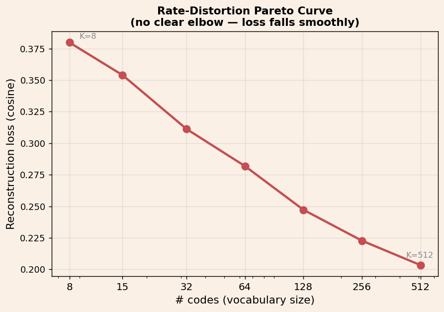
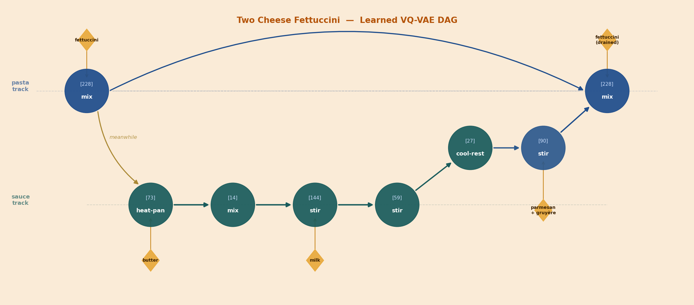
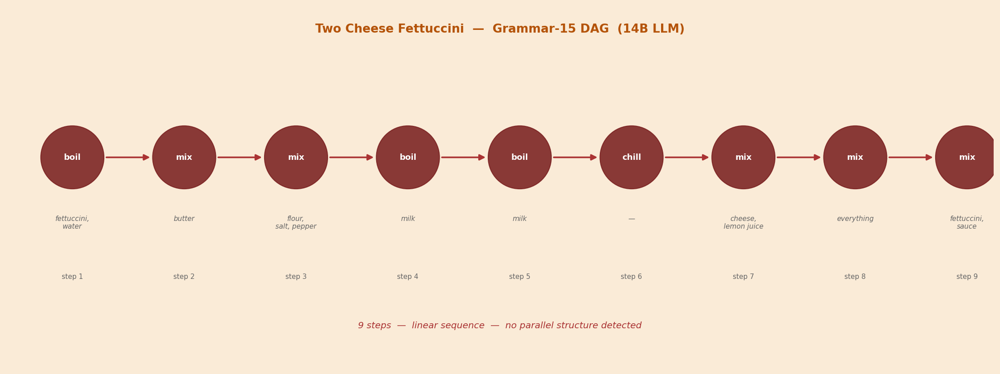

# Learning the Vocabulary of Cooking

**CS 348K (Spring 2026) — Advit Deepak (advit@stanford.edu)**

Presentation: [`slides.pdf`](slides.pdf)

---

## Background and Setup

There are 2.2 million recipes on the web. They're all stored as text — an ingredient list followed by a sequence of steps. This is fine to cook, but terrible to reason over. The information needed to answer basic questions is there, it's just implicit: is this ingredient critical or just decorative? How many pans are in use at the same time? Which steps can run in parallel? If I double the recipe, which steps scale linearly and which don't?

Recipe text is really a *rendering* of an underlying program. The same operation — say, heating oil and softening garlic — gets written four different ways across four different recipes, but they all map to the same typed function call. Once we have that program representation, the questions above become easy to answer: ingredient criticality is an edge in the graph, parallelism is graph reachability, scaling rules are properties of the operation type.

Prior work attacked this by building recipe DSLs — hand-designed vocabularies of cooking operation types:

| DSL | # Primitives | Strategy | Scale |
|---|---|---|---|
| Tasse & Smith, 2008 | 9 | Domain experts | 261 recipes |
| Bollini et al., 2013 | 20 | Hand-crafted | 60 recipes |
| Mori et al., 2014 | 15 | Linguist-defined | 300 recipes |
| Papadopoulos et al., 2022 | 60 | Expert + k-means + Turk | 3,708 recipes |

None are in wide use, for two reasons. First, vocabulary choice is arbitrary — Seoul University lists 134 cooking terms, Wikipedia lists 173, they disagree extensively, and there's no principled way to pick. Second, scaling to millions of recipes requires a large LLM: running Qwen2.5-14B on a 128 GB VRAM machine gets ~1,600 recipes/hour, which means encoding 2.2M recipes would take ~57 days.

The input/output framing: given raw recipe text (an ingredients list + ordered instruction steps), I want to produce a recipe DAG where each node is a discrete operation code from some learned vocabulary and edges capture data flow — both step→step dependencies and which ingredients flow into which steps.

This gives rise to two concrete goals, with a hard practical constraint (no GPU budget to run LLMs on 1M+ recipes):

- **Goal A**: Learn a cooking vocabulary that's semantically coherent and encodes more signal than a human-designed DSL.
- **Goal B**: Generate recipe DAGs that are structurally indistinguishable from a 14B LLM, but at least 100× faster.

The hypothesis: a vocabulary learned purely from reconstruction pressure will both discover distinctions that expert vocabularies collapse and produce DAG quality that matches LLM-based parsing at a fraction of the cost.

The hard part of this project is that recipe steps are context-dependent. "Stir constantly" over caramelizing sugar and "stir constantly" while making a roux are genuinely different operations with different physics — but the verb is identical. When I tried k-means on verb embeddings, it completely missed this distinction: the best silhouette score is 0.051 at K=25, basically random structure.


A useful vocabulary needs to be contextual (aware of prior steps and which ingredients are active), discrete (committable to a finite number of types), and learned from data rather than picked by a human expert.

---

## Approach

> Note: We learn a vocabulary from scratch, no prior recipe DSL codebase was used. The Grammar-15 baseline (Qwen2.5-14B + XGrammar constrained decoding over Mori et al.'s 15-type grammar) was generated as a comparison target, not a starting point.

The k-means result above (silhouette ≈ 0.05) was the first real experiment, and it confirmed what I suspected: cooking verb space doesn't have clean cluster boundaries. We need something that learns the representation jointly with the discretization, conditioned on context. That's where VQ-VAE comes in, inspired by GENIE's approach.

The model is a per-step contextual VQ-VAE trained on 1M recipes from MIT's Recipe1M+ dataset. Each recipe step goes through three stages:

```
Raw recipe text
  ↓  MiniLM-L6-v2 (sentence encoder)
{h_step1, h_step2, ...}  and  {h_ing1, ..., h_ingN}

For step i:
  Causal Encoder:
    h_ti = Projection(h_stepi)
           + SelfAttn(h_stepi, h_step1:i)    ← context from prior steps
           + CrossAttn(h_stepi, h_ing1:N)    ← which ingredients am I acting on?

  EMA Vector Quantizer:
    z_ti = nearest codebook entry to h_ti    ← discrete operation code (one of K)

  Causal Decoder:
    ĥ_stepi = SelfAttn(z_ti, z_t1:i) + CrossAttn(z_ti, h_ing1:N)
              → Projection → ĥ_stepi

Loss = cosine_reconstruction(h_stepi, ĥ_stepi) + VQ_commitment
```

The key design decision is the cross-attention over ingredients in both encoder and decoder. This is what lets the same verb ("stir") map to different codes depending on what's in the pan. Self-attention over prior steps handles sequential context — so "add cream" immediately after searing meat encodes as deglaze, not as a generic addition. EMA codebook updates (rather than straight-through gradient) are necessary to prevent codebook collapse; on the first training attempt without the three-phase warmup, all 256 codes collapsed to ~4 active entries within a few hundred steps.

Training uses three phases: continuous warmup with no VQ (10 epochs), then VQ with EMA updates (20 epochs), then a fine-tune pass with increased dropout (10 epochs). The warmup matters — we need the encoder to produce reasonably organized representations before asking it to commit to discrete codes.

**DAG extraction is free.** During decoding, the model already had to figure out which prior steps and which ingredients were relevant to reconstruct the current step — that's exactly the dependency structure we want. So rather than running a separate model, I just threshold the attention weights the decoder already produced:
- Step s → step t if `SelfAttn(decoder, t, s) > 1/T` (T = total steps)
- Ingredient i → step t if `CrossAttn(decoder, t, i) > 1/8`

No second model, no extra inference pass — the graph comes out as a byproduct of reconstruction.

At K=256, we see that 234 codes are active after training. We pass hundreds of steps through the model and construct a set of steps that led to the highest activation for each code. We then ask an LLM to soft-label each code with a short description. 

What the codebook learns is interesting: `mix` alone splits into 62 distinct codes — whisk, beat, stir, blend-processor, and knead all get separate representations. More surprisingly, entirely new operation types emerge with no Grammar-15 home: `preheat-oven`, `prepare-pan`, `cool-rest`, `glaze`, `layer/assemble`. These came purely from reconstruction pressure on 1M recipes. 

> Check out Slide 17 in `slides.pdf` for a visualization of several codes!

---

## Evaluation and Results

For Goal A, success means the learned codebook's code-frequency histograms predict cuisine and nutritional content better than Grammar-15 histograms at matching vocabulary size (K=15), and keep improving as K grows. For Goal B, success means learned-VQ DAGs are rated indistinguishable from Grammar-15 DAGs by an independent judge (win rate ≈ 50% on 500 recipes), and throughput is ≥1000× faster.

**Setup.** Dataset: MIT Recipe1M+ (1,029,518 recipes; ~37K with cuisine labels across 7 classes and ~51K with nutrition labels). Baseline: Qwen2.5-14B + XGrammar constrained to Mori et al.'s 15-type grammar, run on a 128 GB VRAM GPU (35,726 recipes encoded in 22.2 hours — this was the practical upper limit of what I could run). For downstream representation quality, I compute a frequency histogram over K code entries per recipe and train a linear probe to predict (a) cuisine type (7 classes: american, french, asian, italian, mexican, mediterranean, indian) and (b) nutrition category (calorie bracket). For DAG quality, I drew 500 random recipe pairs — one learned-VQ DAG and one Grammar-15 DAG for the same recipe, order-randomized — and had Claude Sonnet 4.6 pick the better-structured program.

**Representation quality** (Goal A):

| Task | Grammar-15 | VQ K=15 | VQ K=32 | VQ K=64 | VQ K=128 | VQ K=256 |
|---|---|---|---|---|---|---|
| Cuisine AUC | 0.696 | 0.684 | 0.697 | 0.703 | 0.719 | **0.728** |
| Nutrition AUC | 0.655 | 0.661 | 0.699 | 0.729 | 0.756 | **0.772** |

Both tasks improve monotonically with K. At K=15 (matching the grammar's vocabulary size), VQ is comparable to Grammar-15 on cuisine and already ahead on nutrition. By K=256 it's +3.2 pp on cuisine and +11.7 pp on nutrition.

The nutrition gap is the more interesting result. Grammar-15 was designed around physical cooking actions — the vocabulary has no concept of fat content or caloric density. The learned codes are picking up something about ingredient handling and technique (e.g., separate codes for deep-fry vs. steam vs. roast within what Grammar-15 calls `heat`) that correlates with nutritional outcome. That signal just isn't in the expert vocabulary at all.

The rate-distortion curve shows no elbow from K=8 to K=512 (log scale): reconstruction loss falls smoothly, uniformly, with no natural stopping point.

The reason this makes sense is that cooking operations are inherently hierarchical. `heat` is a valid primitive. So is `sauté` — heat with fat as a transfer medium. So is `garlic sauté` — sauté with aromatics at a specific stage. There is no privileged level of granularity, so every additional code captures a real, finer-grained distinction. The curve has no elbow because the operation space has no natural resolution. This means there's no principled answer to "what's the right vocabulary size" — larger is always better, and where we stop is an application-level decision. I use K=256: larger than any human expert's upper bound but tractable to train and analyze.



**DAG quality** (Goal B):

| | Wins | Win rate |
|---|---|---|
| Learned VQ (ours) | 263 | **52.6%** |
| Grammar-15 (14B LLM) | 237 | 47.4% |

p=0.26 (two-sided binomial) — indistinguishable from 50%. A 9 MB encoder matches a 14B-parameter LLM on DAG quality when we have an expert LLM (Claude Sonnet) pick the better representation after being given the ground truth.

Why does this hold up? The LLM baseline is actually quite bad at structural inference. On Two Cheese Fettuccini, Grammar-15 produces a flat chain of nine nodes (`boil → mix → mix → boil → boil → chill → mix → mix → mix`) — it sees the recipe as a sequence, not a parallel program, due to the sequential nature of instructions in recipe text. The learned DAG recovers the parallel structure — a pasta boiling track and a sauce track that only meet at the final mix — with a few minor mistakes (one ingredient edge and one intermediate step label are off):

| Learned VQ DAG | Grammar-15 DAG (14B LLM) |
|---|---|
|  |  |

This parallel structure comes directly from attention thresholding: the decoder's final mix step attends back to both the pasta-track mix and the sauce-track stir, creating two incoming edges. The LLM doesn't have this signal — it's generating text greedily and the grammar forces a tree structure anyway.

**Throughput** (Goal B):

| Method | Recipes | Time | Throughput |
|---|---|---|---|
| Qwen2.5-14B + XGrammar | 35,726 | 22.2 hrs | ~1,610 / hr |
| Process VQ-VAE (ours) | 1,029,518 | 4.3 min | **~14.4M / hr** |

~8,900× faster. In the time the LLM processes 35K recipes, the VQ encoder processes 1M. The speedup is structural: autoregressive LLM decoding is O(steps × vocabulary_size) per recipe; the VQ encoder is a fixed forward pass through a 9 MB model. There's no fundamental tradeoff being made — we're just not doing any generation.

**Where it falls short.** Goal A is only partially met. The vocabulary improves with K but never converges, so I can't point to an "optimal" vocabulary — only say that more codes are always better. The deeper bottleneck is MiniLM: it wasn't trained on recipe text, so its similarity judgments aren't calibrated to culinary distinctions (it probably doesn't know that sauté and sweat are genuinely different processes). A domain-fine-tuned encoder would likely sharpen the codebook considerably. The grammar auxiliary loss experiment confirms this — adding Grammar-15 supervision doesn't help because the bottleneck is in the embeddings, not the codebook training.

The other gap is ground truth. Every DAG quality comparison goes through an LLM judge comparing against another LLM's output. There's no human-annotated test set at scale. The 52.6% win rate is real, but "indistinguishable from a 14B LLM" is a lower bar than "correct."

**What's Next.** Once we have a recipe program, a discrete learnable vocabulary, we can optimize it. For example, we can fix the ingredients, and by building a graph of process codes, steer the recipe  a target like flavor or calories using methods such as Stochastic Rewrite Descent (which we had learned in the Design for Descent paper). I'm very excited to try this out!

---

## Team Responsibilities

Solo project — all work by Advit Deepak (with the help of tools like Claude).

*Also thank you so much to the teaching team (especially Jihyeon's feedback throughout!!)*

---

## References

- Tasse, D. & Smith, N. A. (2008). SOUR CREAM: Toward Semantic Processing of Recipes. *CMU Technical Report.*
- Bollini, M., Barry, J., Gombolay, M., Huang, T., Koval, M., Tedrake, R., & Shah, J. (2013). Interpreting and executing recipes with a cooking robot. *ISER.*
- Mori, S., Maeta, H., Yamakata, Y., & Sasada, T. (2014). Flow graph corpus from recipe texts. *LREC.*
- Papadopoulos, D. P., Mora, E., Chepurko, N., Huang, K.-W., Ofli, F., & Torralba, A. (2022). Learning Program Representations for Food Images and Cooking Recipes. *CVPR.*
- Salvador, A., Hynes, N., Aytar, Y., Marin, J., Ofli, F., Weber, I., & Torralba, A. (2017). Learning Cross-modal Embeddings for Cooking Recipes and Food Images. *CVPR.* (Recipe1M+ dataset.)
- van den Oord, A., Vinyals, O., & Kavukcuoglu, K. (2017). Neural Discrete Representation Learning (VQ-VAE). *NeurIPS.*
- Ge, Y., et al. (2022). DALL-E-Bot / GENIE — vector quantization approach for generative modeling.
- Wang, W., et al. (2022). Text Embeddings by Weakly-Supervised Contrastive Pre-training (MiniLM-L6-v2). *EMNLP.*
- Qwen2.5-14B: Bai, J., et al. (2023). Qwen Technical Report. *arXiv.*
- XGrammar: constrained decoding library for structured LLM output.

---

## Setup

```bash
pip install -r requirements.txt
```

**GPU**: ≥8 GB VRAM for inference; ≥24 GB for Stage 2 (Qwen LoRA decoder).

**External data** (not included in repo):

| Env var | Default | What it points to |
|---|---|---|
| `RECIPE1M` | `~/layer1.json` | Recipe1M+ — request access at [im2recipe.csail.mit.edu](http://im2recipe.csail.mit.edu/) |
| `FOODCOM_DIR` | `~/foodcom_data/` | food.com Kaggle dataset (only for `build_enriched_dataset.py`) |

---

## Running the Pipeline

### 0. Build dataset + cache embeddings

```bash
# Joins Recipe1M with cuisine/nutrition labels
python3 scripts/build_enriched_dataset.py

# Caches MiniLM step + ingredient embeddings (~20 min on GPU)
# Reads: data/dags/fast_dags.jsonl   Writes: data/models/embeddings/
python3 scripts/cache_step_embeddings.py
```

The pre-computed cache is already in `data/models/embeddings/` (16 GB, not tracked in git).

### 1. Train Stage 1 — VQ-VAE

```bash
# Pure reconstruction, K=256 by default
python3 scripts/process_vae_stage1.py

# With grammar cross-entropy auxiliary loss (uses Grammar-15 labels for the 35K overlap recipes)
python3 scripts/process_vae_stage1_grammar.py --n_codes 256

# Resume or skip phases
python3 scripts/process_vae_stage1.py --resume     # resume from phase 2
python3 scripts/process_vae_stage1.py --phase 3    # jump straight to fine-tune
```

Checkpoints → `data/models/process_vae/` (or `process_vae_grammar/`)

### 2. Evaluate the codebook

```bash
python3 scripts/process_vae_eval.py                  # cuisine + nutrition AUC
python3 scripts/process_vae_codebook_analysis.py     # semantic label per code
python3 scripts/process_vae_pareto.py                # rate-distortion curve (K=8…256)
python3 scripts/process_vae_grammar_classifier.py    # VQ code ↔ grammar type alignment
```

### 3. Stage 2 — Qwen LoRA decoder (optional)

Needed only for text roundtrip. Freezes Stage 1 and fine-tunes Qwen2.5-3B with LoRA conditioned on the discrete DAG codes.

```bash
python3 scripts/process_vae_stage2.py
# Checkpoints → data/models/process_vae_stage2/lora_best/
```

### 4. DAG extraction + judge evaluation

```bash
# Extract DAGs via attention weights; run LLM-as-judge vs Grammar-15
python3 scripts/process_vae_dag_eval.py --n 500     # replicates the 52.6% result

# ROUGE roundtrip (encode → Stage 2 decode → compare to original text)
python3 scripts/process_vae_dag_eval.py --mode rouge
```

### 5. End-to-end pipeline (single recipe)

```bash
# Encode to DAG
python3 scripts/process_vae_pipeline.py \
    --recipe "Mix flour and butter. Bake at 350F for 20 minutes."

# Encode + decode back to text (requires Stage 2)
python3 scripts/process_vae_pipeline.py --recipe "..." --decode
```

### 6. Visualize

```bash
python3 scripts/viz_learned_dag.py       # per-recipe DAG figures → data/figures/
python3 scripts/analyze_dags.py          # corpus-level statistics
python3 scripts/vocab_analysis.py        # vocabulary coverage curves
```

### Grammar-15 baseline

The pre-generated 14B LLM DAGs are in `data/dags/constrained_dags_14b.jsonl` (35K recipes, Qwen2.5-14B + XGrammar, 128 GB VRAM to regenerate). For a fast no-GPU keyword-rule alternative:

```bash
python3 scripts/parse_dags_fast.py
# Outputs: data/dags/fast_dags.jsonl  (~seconds, no GPU needed)
```

---

## Repository Structure

```
culinary-descent/
│
├── scripts/
│   ├── process_vae_model.py          # VQ-VAE architecture (encoder, quantizer, decoder)
│   ├── process_vae_stage1.py         # Stage 1 training (pure reconstruction)
│   ├── process_vae_stage1_grammar.py # Stage 1 with Grammar-15 auxiliary supervision
│   ├── process_vae_stage2.py         # Stage 2: Qwen LoRA decoder over discrete codes
│   ├── process_vae_stage3.py         # DAG extraction from attention weights
│   ├── process_vae_eval.py           # Downstream AUC (cuisine + nutrition)
│   ├── process_vae_dag_eval.py       # LLM-as-judge + ROUGE evaluation
│   ├── process_vae_codebook_analysis.py  # Per-code semantic labels + category
│   ├── process_vae_pareto.py         # Rate-distortion curve across K values
│   ├── process_vae_grammar_classifier.py # VQ ↔ Grammar-15 alignment
│   ├── process_vae_decomposed_eval.py    # Per-dimension judge (labels / ingredients / structure)
│   ├── process_vae_pipeline.py       # End-to-end single-recipe encode/decode
│   ├── cache_step_embeddings.py      # MiniLM embedding cache generation
│   ├── build_enriched_dataset.py     # Recipe1M + food.com join
│   ├── parse_dags_fast.py            # Keyword-rule DAG parser (no GPU)
│   ├── viz_learned_dag.py            # DAG figure generation (graphviz)
│   ├── analyze_dags.py               # Corpus statistics and structural queries
│   └── vocab_analysis.py             # Vocabulary coverage + clustering analysis
│
├── data/
│   ├── models/
│   │   ├── embeddings/               # MiniLM cache: step_embs.npy, per_ing_embs.npy,
│   │   │                             #   step_index.json, recipe_ids.json, step_texts.json
│   │   │                             #   (16 GB total, not tracked in git)
│   │   ├── process_vae/              # Main model (K=256, no grammar supervision)
│   │   │   ├── stage1_final.pt       #   ← use this for inference
│   │   │   ├── stage1_phase3_best.pt
│   │   │   ├── grammar_classifier.pt
│   │   │   ├── codebook_labels.json  #   top step texts per code
│   │   │   ├── codebook_analysis.json #  semantic label + category per code
│   │   │   ├── downstream_auc.json   #   cuisine/nutrition AUC
│   │   │   ├── grammar_alignment.json #  VQ ↔ Grammar-15 mapping
│   │   │   └── pareto_curve.json     #   rate-distortion at K=8,15,32,64,128,256
│   │   ├── process_vae_grammar/      # K=256 with Grammar-15 auxiliary loss
│   │   ├── process_vae_grammar_k512/ # K=512 ablation
│   │   ├── process_vae_grammar_v2/   # v2 grammar model
│   │   ├── process_vae_meta/         # Meta-features ablation
│   │   ├── process_vae_no_grammar/   # No-grammar ablation (same as process_vae but explicit)
│   │   ├── process_vae_stage2/       # Qwen LoRA decoder
│   │   └── process_vae_stage2_grammar/ # Qwen decoder for grammar-supervised variant
│   │
│   ├── dags/
│   │   ├── constrained_dags_14b.jsonl       # Grammar-15 baseline, 35K recipes (Qwen 14B)
│   │   ├── constrained_dags_14b_filtered.jsonl  # After transition-matrix filter
│   │   ├── learned_dags_grammar.jsonl       # VQ-VAE DAGs, grammar-supervised model
│   │   ├── learned_dags_grammar_v2.jsonl
│   │   └── learned_dags.jsonl               # VQ-VAE DAGs, no grammar supervision
│   │
│   ├── figures/
│   │   ├── process_kmeans_elbow.png         # K-means silhouette (slide 14)
│   │   ├── process_vae_pareto.png           # Rate-distortion curve (slide 18)
│   │   ├── vq_dag_fettuccini_learned.png    # Learned DAG example (slide 21)
│   │   └── vq_dag_fettuccini_grammar.png    # Grammar-15 comparison (slide 33)
│   │
│   ├── enriched/                     # Recipe1M + cuisine/nutrition metadata
│   └── vocab_analysis/               # Coverage curves, verb frequency, dendrogram
│
├── slides.pdf
├── requirements.txt
└── .gitignore
```
