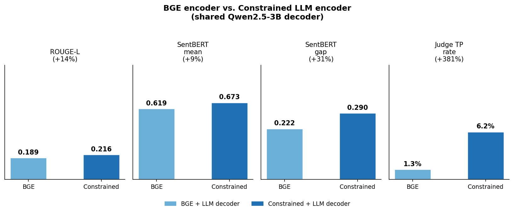
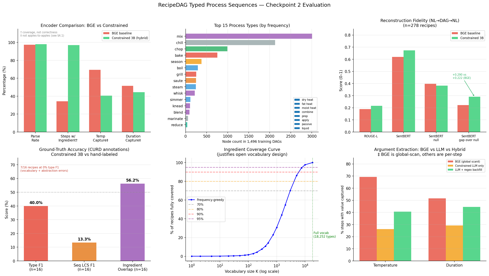

# Recipe DAGs: Typed Process Sequences from Natural Language

**CS 348K — Advit Deepak (advit@stanford.edu) · Checkpoint 2**

---

## The Problem

Recipes on the internet are just blocks of unstructured text. This means that everything about the cooking process — the order of steps, which ingredient gets used where, how long things take, what can happen in parallel — is buried in prose and completely implicit. Because text is written for a human to read top-to-bottom, not for a program to query, it's difficult to extract structured information. For example, the following are surprisingly hard:

- **Search by process, not keywords.** You can search for "marinate" and "grill" in a recipe, but you can't ask "give me recipes where marinating actually happens before grilling." The order is encoded in sentence position and natural language inference, not in any queryable structure.
- **Dietary substitution.** If you want to make a recipe vegan, you need to know not just that "butter" appears in the recipe, but which specific steps use it, and whether swapping it matters for that step's cooking chemistry. "Replace all butter with olive oil" is a text substitution; knowing that step 3's butter is for sauteing (swap it) and step 8's butter is for a sauce finish (swap differently) requires understanding attribution.
- **Parallelization.** Most recipe instructions are written sequentially even when steps could happen simultaneously. "While the sauce simmers, prep the vegetables" is sometimes written out, but often not. Figuring out which steps are independent requires understanding ingredient flow — which step's output feeds into which step's input.
- **Scaling and modification.** Doubling a recipe isn't just doubling every number. Cook times scale differently than quantities, and some steps change character entirely at different scales. None of this is recoverable from text without parsing the whole thing fresh every time.

The underlying issue is that a recipe's text is a rendering of a process — a flat projection of what is actually a structured, typed sequence of operations with dependencies and parameters. The text is the output. The goal of this project is to extract the structure underneath it.

---

## Background and Pivot

My original proposal depended on **Papadopoulos et al. (CVPR 2022)** for a supervision signal on recipe image-to-program alignment. However, after submitting my proposal, I realized that their code has been marked "Coming Soon" for four years. After pivoting (see Week 6 checkpoint), I shifted to the program representation problem itself: can we develop a method to extract typed process sequences from natural language recipes, what should these sequences look like, and are they actually useful over the original natural language?

---

## Related Work

I analyzed several related works (mostly discussed in previous checkpoint, but recapped here):

| Prior work | What they do | What's different here |
|---|---|---|
| Mori et al. (2014) "Flow Graph Corpus" | Hand-annotated ~300 recipes as ingredient-dependency DAGs | I automate extraction at a much larger scale (so far, 35K recipes); they showed the representation is feasible, this shows it's scalable |
| Tasse and Smith (2008) CURD (Cooking Underpinning Recipe Dataset) | Formal process-algebra annotation of 261 recipes, used as my ground truth | My contribution is automatic extraction, not representation design |
| Salvador et al. (2017) im2Recipe / Recipe1M | Cross-modal image-to-recipe retrieval using flat text embeddings | The dataset I used; they treat recipes as flat text, I extract structure; their embedding approach is my baseline |
| Rashkin et al. (2018) ProPara | Entity state changes through procedural text | Related goal but entity-centric (tracks ingredient state) not flow-centric (tracks what operation acts on what); no DAG output |
| Beurer-Kellner et al. (2023) LMQL / Outlines | Constrained LLM decoding frameworks | I use their technique; my 43-type schema is an instance of grammar-constrained generation |

---

## The Representation

Before we discuss the journey to this representation, let's first understand what this representation looks like. At a high level, a recipe becomes a **typed process sequence** — an ordered chain of steps, each a canonical cooking operation (one of 43 types, which we also discuss below) with an explicit per-step ingredient list and optional temperature/duration arguments.

```json
{
  "id": "recipe_017341",
  "title": "Honey Sriracha Chicken Wings",
  "steps": [
    { "canonical": "mix",   "ingredients": ["sriracha", "honey", "soy sauce"], "temp_f": null, "duration_min": null },
    { "canonical": "crush", "ingredients": ["chicken wings"],                   "temp_f": null, "duration_min": null },
    { "canonical": "bake",  "ingredients": ["chicken wings"],                   "temp_f": 425,  "duration_min": 45  },
    { "canonical": "stir",  "ingredients": ["sriracha sauce"],                  "temp_f": null, "duration_min": null }
  ]
}
```

The current implementation is a **linear chain**, not a full DAG — it doesn't represent parallel branches like "while X simmers, prepare Y." However, it is straightforwad to later convert this to a full DAG based on ingredient dependencies, and the linear chain is easier to work with for comparing structured to unstructured representations.

---

## Design Decisions

First, we have to figure out how many unique cooking operations exist.

### Why 43 Process Types?

To do this, we have to first find recipe data. The data for this project comes from **Recipe1M** (Salvador et al., 2017), a dataset of approximately 1 million recipes scraped from cooking websites. Each recipe includes a title, ingredient list, and free-text instructions. I elected to start with a subset of 51K recipes with complete instruction text. I split these 51K into a train and test set. For all the recipes in the test set, I extracted cooking verbs using spaCy's dependency parser — specifically, I collected all tokens tagged as verbs (POS tag `VERB`) that appeared as the root of an instruction sentence or as a direct child of the root. This gave me a vocabulary of ~2,400 unique verb lemmas across the corpus.

To determine how many canonical process types are needed, I ran k-means on BGE (a general-purpose text embedding model) embeddings of these cooking verbs and plotted how many unique sequences are needed to cover different fractions of the corpus.


The elbow in inertia is real at K approximately 43. Below this, semantically distinct operations collapse (`bake` absorbs `roast`, `dice` absorbs `chop`). Above it, near-synonyms split artificially and the vocabulary becomes harder for a language model to use consistently. The coverage curve (middle panel) shows that 95% of the corpus is covered by a relatively small number of unique sequence templates — the vocabulary is bounded, not open-ended.

> Note: I realize that a better test would require human annotation asking "is the right verb in these 43?" The CURD ground-truth annotations use verbs like `cut`, `peel`, `combine`, and `serve` that don't map cleanly to the 43 — a real limitation. The 43 types are data-driven, not a chef's taxonomy, which is something I will try to improve.

### Representing Ingredients?

I ran the same coverage analysis on ingredients that I ran on processes. The results made the decision obvious:

| Coverage target | Process types needed | Ingredient types needed |
|---|---|---|
| 50% | 8 | 847 |
| 90% | 31 | 4,219 |
| 95% | 43 | 7,583 |
| 99% | 67 | 18,412 |

Processes follow a power law with a short tail — 43 types cover 95% of the corpus. Ingredients follow a power law with a long tail — you need 7,500+ types for the same coverage, and the tail keeps going (brand names, regional variants, compound ingredients like "low-sodium chicken broth"). A 7,500-type vocabulary would make grammar-constrained decoding intractable and force lossy mappings ("sriracha" → "hot sauce" → information loss). Keeping ingredients as free-form strings preserves the original specificity at no schema cost.


### LLM with Grammar-Constrained Decoding

Now, we have to figure out how to turn unstructured recipes into this format. One option is to simply instruct an LLM.

However, parsing free-form LLM output with regex, fails unpredictably. A model might output `sautee` instead of `saute`, or wrap the JSON in markdown code fences, or hallucinate a 44th process type. Post-hoc repair is fragile, as we are pattern-matching against an unbounded space of possible malformations. 

To solve this, I implemented grammar-constrained decoding. The schema enum on canonical types means the model cannot output an invalid process type — not hoping it won't, but the decoding algorithm actively forbids it. For encoding recipes, I created a pipeline that uses Qwen2.5-3B-Instruct with XGrammar (a structured output backend for vLLM) that enforces the JSON schema at the token level. This leads to a parse success rate from ~85% (unconstrained + regex repair) to 98% (constrained) across the 51K recipes.

### Verifying Parses

The Week 6 checkpoint proposed 8 hand-crafted predicates (raw protein must pass through a heat operation, etc.). I really appreciated Jihyeon's feedback that this doesn't scale — there are too many legitimate step combinations and the line between "valid" and "unusual" is blurry. The current approach is a learned transition matrix: P(next step type | current step type) over all 43 x 43 pairs, estimated from 153,000 step transitions in the training corpus.


A sequence scores low if it uses step-type pairs that almost never co-occur in real recipes (`bake` then `marinate` is statistically anomalous; `saute` then `simmer` is common). This sidesteps the predicate enumeration problem — validity is corpus-derived, not hand-specified. The matrix currently only validates that training DAGs are self-consistent (99.4% pass rate) and isn't yet wired up as an encoding filter, which is the remaining gap.

---

## Evaluation plan and metrics

Four questions drive my evaluation:

1. **Encoder quality** — how accurately does the extractor populate the representation? Primary metric: steps with at least one ingredient correctly attributed (coverage) and ingredient overlap against CURD ground-truth annotations (correctness).

2. **Round-trip fidelity** — NL to DAG to NL: how much semantic content survives the compression? To measure this, I feed the DAG into a decoder (Qwen2.5-3B) and compare the output to the original. The primary metric is SentBERT (Sentence-BERT, a model that produces sentence-level embeddings for semantic similarity) gap over null, where null is the SentBERT similarity between random unrelated recipe pairs from the same domain — a floor for how similar two recipes can look without actually sharing content.

3. **Ground-truth accuracy** — CURD has 261 hand-annotated formal cooking DAGs, 16 of which matched to my corpus by title. These are the only external check against human labels.

4. **Downstream utility** — does the representation enable things raw text can't support? Two tests: process-ordered structural queries and closed-loop vegan adaptation compared against a direct LLM prompt.

---

## Results

### Encoder comparison: BGE baseline vs. constrained LLM

Running both encoders on the train split gives 35,162 DAGs at 98% parse rate for the constrained encoder, about 3 seconds per recipe on one GPU.

| | BGE encoder | Constrained 3B (hybrid) |
|---|---|---|
| Parse rate | 97.5% | 98.0% |
| Steps with at least 1 ingredient assigned | 34.2% | 97.0% |
| Temperature arguments captured | 69.3% | 40.6% |
| Duration arguments captured | 51.6% | 44.5% |

> Note on ingredient coverage: 97% is a coverage number, not a correctness number. A step with the wrong ingredient assigned still counts. The honest number is from the CURD evaluation below: 37.3% ingredient overlap against human labels. 97% is what the encoder reports; 37% is what external validation says. That difference matters.

> Note on temperature/duration: The reason for the performance difference is likely that BGE scans the full recipe text globally and grabs any number it finds. My encoder assigns values per step, which is a harder task. BGE's 69.3% almost certainly inflates because it attributes a step 1 oven preheat to every subsequent step.

### Round-trip fidelity


| | BGE + decoder | Constrained + decoder | Difference |
|---|---|---|---|
| ROUGE-L (n-gram overlap with original) | 0.189 | 0.216 | +14% |
| SentBERT similarity to original | 0.619 | 0.673 | +8.7% |
| SentBERT gap over null (null = 0.398) | +0.222 | +0.290 | +31% |
| LLM judge true-positive rate | 1.3% | 6.25% | 4.8x |

n=278 recipes. The decoder is held constant — both encoders feed Qwen2.5-3B for decoding.

> Note: In retrospect, I realize that ROUGE-L is the wrong metric here. "In a large skillet heat oil over medium-high heat" and "saute the ingredients in a pan" are executably equivalent but lexically different. The SentBERT gap over null is the better signal — it measures how much content the round-trip preserves relative to how similar two random unrelated recipes happen to look.

The 6.25% judge true-positive rate reflects a bad judge as much as a bad reconstruction. Qwen2.5-3B judging semantic equivalence of two full recipes is a task the 3B model isn't calibrated for. The 100% true-negative rate (correctly rejects shuffled and negated pairs) tells me the judge is conservative, not that reconstruction is bad. A stronger judge or human evaluation would be needed to interpret the true-positive rate.



### Ground-truth accuracy: CURD

| | Score |
|---|---|
| Canonical type precision | 30.8% |
| Canonical type recall | 48.5% |
| Type F1 | 37.6% |
| Sequence longest-common-subsequence F1 | 23.6% |
| Per-step ingredient overlap | 37.3% |

n=16 CURD recipes matched by title. These numbers are bad, and not all of it is abstraction mismatch. Seven of 16 recipes get 0% type F1 — including "Buttermilk Shake" (my encoder outputs `blend`, CURD says `mix`; both are in the vocabulary — a genuine encoder error) and "Basic Chicken Stock" (the encoder outputs `toast` twelve times in a row — the 3B model collapses under long repetitive text). Some failures do come from abstraction mismatch (CURD annotates sub-operations per sentence; I extract one step per instruction, so my sequences are shorter and step boundaries don't align). But word-level errors like `blend` vs `mix` and `grill` vs `saute` can't be explained away.

The 37.3% ingredient overlap is the number that should temper the encoder comparison table. "97% of steps have an ingredient assigned" means some ingredient. Against human labels, the right ingredient appears 37% of the time.

### Closing the adaptation loop: DAG-guided vs. direct LLM

The obvious challenge to this whole approach: why not just prompt a language model to rewrite the recipe as vegan directly? I ran this comparison on 50 non-vegan recipes (Qwen2.5-3B).

| | DAG-guided | Direct LLM |
|---|---|---|
| Constraint satisfaction (animal-free fraction of outputs) | 97.8% | 97.6% |
| Substitution ingredient coverage | 92.3% | 37.6% |
| SentBERT similarity to original | 0.661 | 0.841 |
| Animal ingredient leaks (total instances across 50 recipes) | 61 | 68 |
| Per-recipe wins on constraint satisfaction | 16 | 9 (25 ties) |

Both approaches eliminate animal products at 97-98% — Qwen2.5-3B is a capable instruction-follower and "rewrite as vegan" is a natural directive. The DAG approach wins slightly more often (16 vs 9 recipes, 25 ties). The direct LLM has a more diverse leak profile (chicken, bacon, pork, buttermilk, honey — harder-to-spot items); the DAG approach mostly leaks dairy and eggs where the substitution table doesn't cover the ingredient name.

The dramatic difference is substitution coverage: 92% vs 38%. The DAG approach generates an explicit plan — step 3 (crush): chicken wings to tofu, step 5 (stir): butter to vegan butter — and then decodes from the edited DAG, so the substitutes are already in the prompt. The direct LLM has to figure out what to substitute on its own, with no explicit plan. Because everything is laid out in the DAG, the substitution is auditable: you can inspect and verify the edit plan before decoding, and the decoder follows it faithfully.

The cost is fluency. The encode-decode bottleneck loses information — compressing a full recipe into a 43-type sequence discards prose structure and qualitative descriptors. Direct LLM stays closer to the original (SentBERT 0.841 vs 0.661). The trade-off is audibility vs. fluency: a nutrition tracking app wants audibility (which step lost the dairy, and what replaced it?); a recipe generator wants fluency. Neither is strictly better.

### Downstream structural queries

Running directly on the 35K DAGs, no additional NLP needed:

| Query | Matches | Why natural language search fails |
|---|---|---|
| marinate then grill (ordered) | 168 | keyword match gets 173 but cannot enforce order |
| grill then marinate (wrong order) | 5 | same keywords, 34:1 ratio invisible to text search |
| knead then bake (bread recipes) | 1,462 | "knead" is often implicit in prose |
| No-heat recipes | 11,820 (33%) | "no-cook" in title covers fewer than 5% of these |

The advantage is composability: `marinate then grill AND at most 4 steps AND no dairy` is one predicate sweep over structured data, no re-parsing, and works for any process-pair combination without writing a new regex.

---

## What We've Started to Answer

**The process vocabulary is finite, bounded, and data-derivable.** 43 types from k-means, not a chef's taxonomy.

**Ingredient-step attribution requires semantic understanding, not substring matching.** 97% vs 34% coverage. Against CURD, correctness is 37.3% — real room to improve, but the coverage difference alone shows substring matching isn't sufficient.

**Better encoding propagates to better reconstruction.** Richer decoder prompts (with attribution) produce better SentBERT similarity and judge agreement. A proper causal ablation would hold prompt format constant while varying only attribution quality — I haven't run that yet.

**The DAG enables structural operations raw text can't support.** Process-ordered retrieval and step-level dietary adaptation both demonstrated at corpus scale.

**DAG-guided adaptation is more auditable than direct LLM rewriting, but not more constraint-satisfying in absolute terms.** Constraint satisfaction is nearly identical; the value of the representation is the explicit, inspectable edit plan.

---

## What I'll be Working On

**Temperature and duration capture is below the BGE baseline (40.6% vs 69.3%).** This is partly a methodology confound — BGE is a global scan, mine is per-step — but per-step extraction is leaving real values on the table. Implicit temperatures in surrounding context ("preheat oven to 350°F" two sentences before the bake step) fall outside the per-step regex window. Plan: expand the regex window to include the prior instruction sentence, or carry the oven preheat temperature forward explicitly through the DAG structure.

**Ground-truth accuracy is weak at n=16.** Type F1 is 37.6% and ingredient overlap is 37.3%. Seven of 16 recipes get 0% type F1 including word-level errors (`blend` vs `mix`) that abstraction mismatch cannot explain. n=16 is too small for strong conclusions. Plan: fuzzy title matching (edit distance or embedding similarity) would likely expand the CURD overlap from 16 to 40-60 recipes.

**The transition matrix is computed but not integrated.** The learned P(next step type | current step type) matrix currently only validates that training DAGs are internally consistent (99.4% pass rate). It should be used as a filter during encoding — flag outputs with low transition-matrix scores and either re-sample or fall back to the BGE parse. If a component doesn't change any decisions, it's not doing anything.


---

## Qualitative examples

**Example A — Simple recipe, good extraction** (SentBERT similarity 0.78)

| | Text |
|---|---|
| Original | Combine peanut butter with milk and honey and blend, adding water until creamy. |
| DAG | `blend [peanut butter, milk, honey]` |
| Decoded | Add peanut butter, milk, and honey to a blender and blend until smooth. |

The qualitative endpoint "until creamy" is discarded by the bottleneck. ROUGE-L penalizes the rephrasing; SentBERT captures the equivalence.

**Example B — Multi-step, where ROUGE-L and SentBERT disagree** (ROUGE-L 0.33, SentBERT 0.89)

| | Text |
|---|---|
| Original | Beat confectioners sugar, butter, and lemon juice until smooth. Add milk, combine until fluffy. |
| DAG | `beat [confectioners sugar, butter, lemon juice]` then `mix [milk]` |
| Decoded | Beat the confectioners sugar and butter until creamy. Add lemon juice. Gradually mix in the milk. |

Same operations, same order, same ingredients — different surface form. ROUGE-L 0.33, SentBERT 0.89.

**Example C — Failure: wrong canonical type** (SentBERT 0.48)

| | Text |
|---|---|
| Original | Combine flour, oats in bowl. Stir in water and peanut butter. Knead. Bake 350°F 40 min. |
| DAG | `poach [wheat flour, oats] at 350°F` then `mix` then `knead` then `bake at 350°F 40min` |
| Decoded | Poach wheat flour and oats at 350°F... |

`combine flour in bowl` was mapped to `poach` — the nearest heat verb in embedding space. The correct type (`mix`) is in the vocabulary. This is a prompt-level encoder error, not a DSL expressiveness failure.

---

## Figures



---

## Repo layout

```
scripts/
├── phase9_constrained_corpus.py    — encode 35K train recipes (GPU, Qwen2.5-3B, ~6hr)
│                                     input: recipes.json (train partition)
│                                     output: data/dags/constrained_dags.jsonl
├── phase9b_arg_backfill.py         — regex backfill for temperature/duration
│                                     input: constrained_dags.jsonl + recipes.json
│                                     output: constrained_dags_hybrid.jsonl
├── phase10_constrained_14b.py      — benchmark on held-out test split (GPU)
│                                     input: recipes.json (test partition, 500 sample)
│                                     output: data/eval/phase10_stats.json
├── phase11_applications.py         — structural queries + dietary adaptation plans (no GPU)
│                                     input: constrained_dags.jsonl
│                                     output: data/eval/phase11_applications.json
├── phase12_xml_eval.py             — compare against CURD XML ground truth (no GPU)
│                                     input: constrained_dags.jsonl + annotated_recipes/*.xml
│                                     output: data/eval/phase12_xml_eval.json
├── phase13_adaptation_loop.py      — DAG-guided vs direct LLM adaptation, n=50 (GPU, ~5min)
│                                     input: constrained_dags.jsonl + recipes.json
│                                     output: data/eval/phase13_adaptation_loop.json
├── analyze_dags.py                 — corpus statistics on constrained_dags.jsonl (no GPU)
├── checkpoint2_figures.py          — generate evaluation figures (no GPU, uses SentBERT)
└── archive/                        — phases 1-8 (pre-pivot DSL exploration)

data/
├── dags/
│   ├── constrained_dags.jsonl        — 35,162 DAGs (train partition)
│   ├── constrained_dags_hybrid.jsonl — same with regex-filled temperature/duration
│   └── transition_matrix.json        — learned P(B|A) over 43x43 process transitions
├── eval/                             — per-phase result JSONs and logs
└── figures/                          — evaluation plots

../annotated_recipes/  — CURD XML ground truth (261 recipes)
../recipes.json        — Recipe1M text data (51K recipes)
```

---

## Reproduce

All scripts use hardcoded absolute paths at the top. Edit `RECIPE1M`, `DAGS_DIR`, and `OUT` if your layout differs.

```bash
pip install -r requirements.txt

# 1. Encode train split — GPU, Qwen2.5-3B, about 6 hours for 35K recipes
python3 scripts/phase9_constrained_corpus.py

# 2. Regex backfill for temperature/duration — no GPU needed
python3 scripts/phase9b_arg_backfill.py

# 3. Benchmark on held-out test split — GPU
#    Use Qwen2.5 family. Qwen3 has a tokenizer incompatibility with XGrammar
#    (apostrophe tokens trigger a JSON state machine bug) that corrupts ~55% of outputs.
python3 scripts/phase10_constrained_14b.py --model Qwen/Qwen2.5-14B-Instruct --n 500 --split test

# 4. Structural queries and adaptation planning demos — no GPU
python3 scripts/phase11_applications.py

# 5. Ground-truth evaluation against CURD — no GPU
python3 scripts/phase12_xml_eval.py

# 6. DAG-guided vs. direct LLM adaptation comparison — GPU, Qwen2.5-3B, about 5 minutes
python3 scripts/phase13_adaptation_loop.py

# 7. Corpus statistics — no GPU
python3 analyze_dags.py

# 8. Generate all figures — no GPU (downloads SentBERT weights on first run)
python3 scripts/checkpoint2_figures.py
```


> Note: I used Claude to help polish some of the README! 